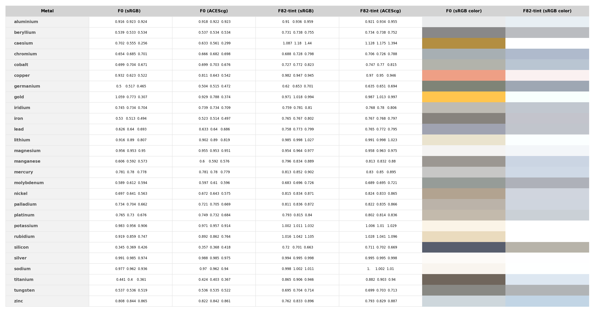

# F82-tint-generator

Computes F82-tint model parameters for various metals based on tabulated IOR.

The F82-tint model is used to describe metals in the [OpenPBR Surface](https://github.com/AcademySoftwareFoundation/OpenPBR) shading model.

